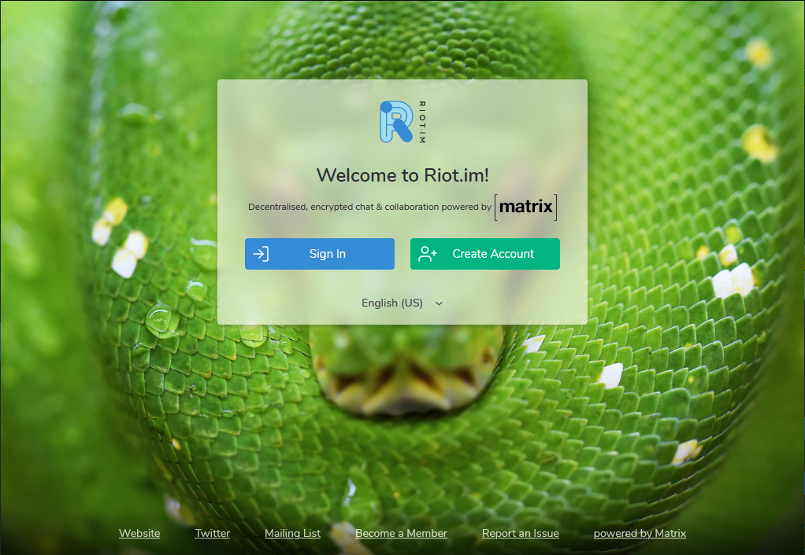
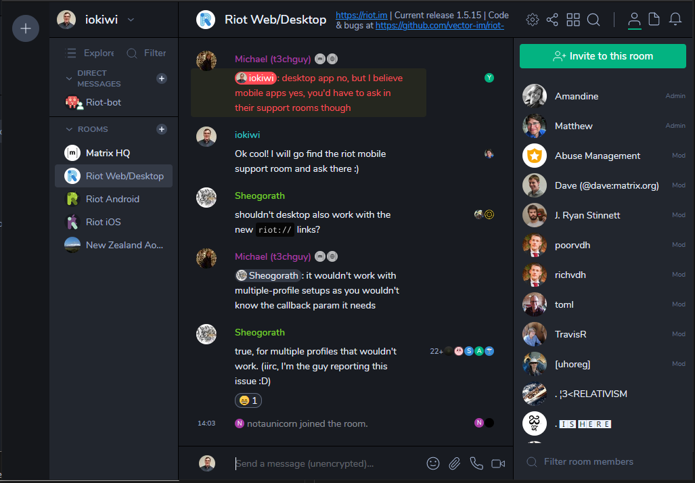
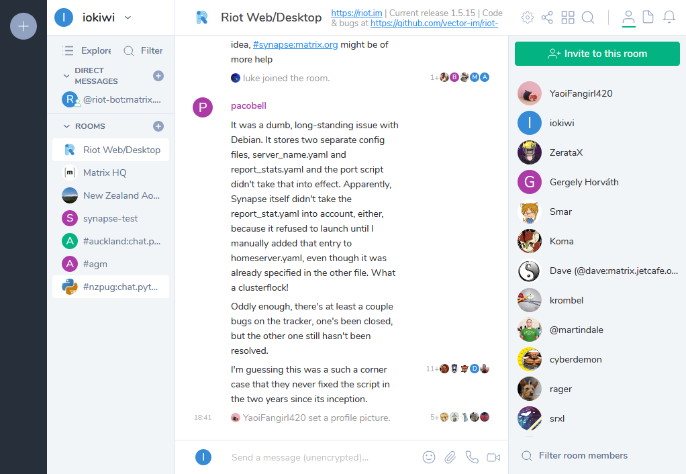
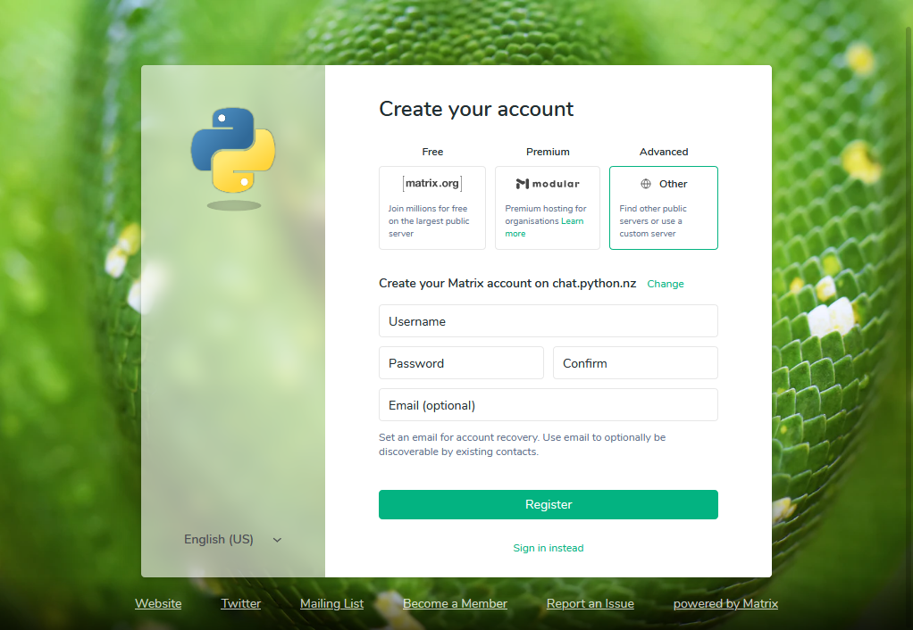
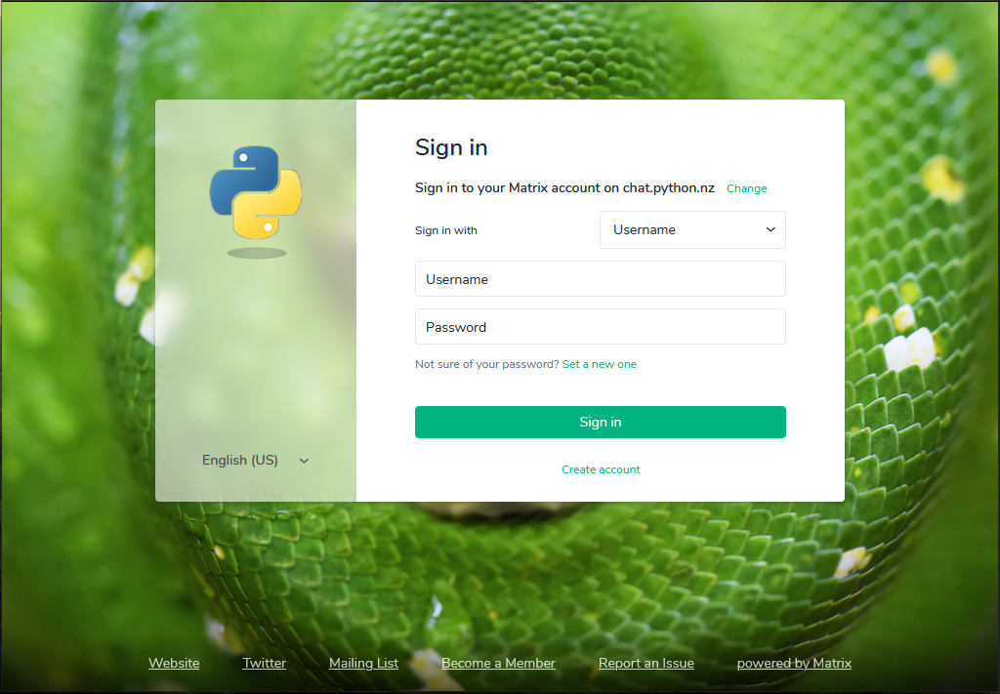
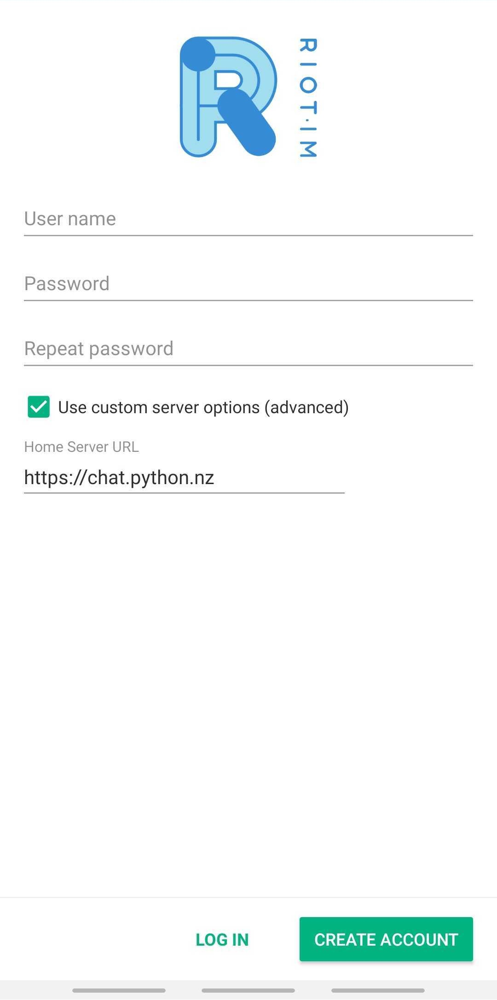
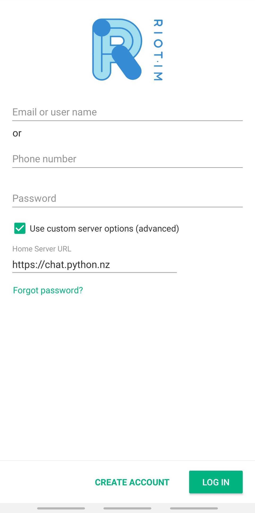
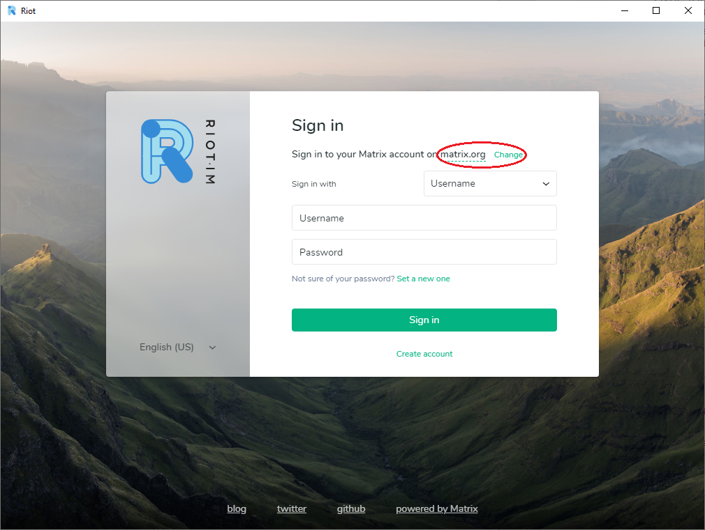
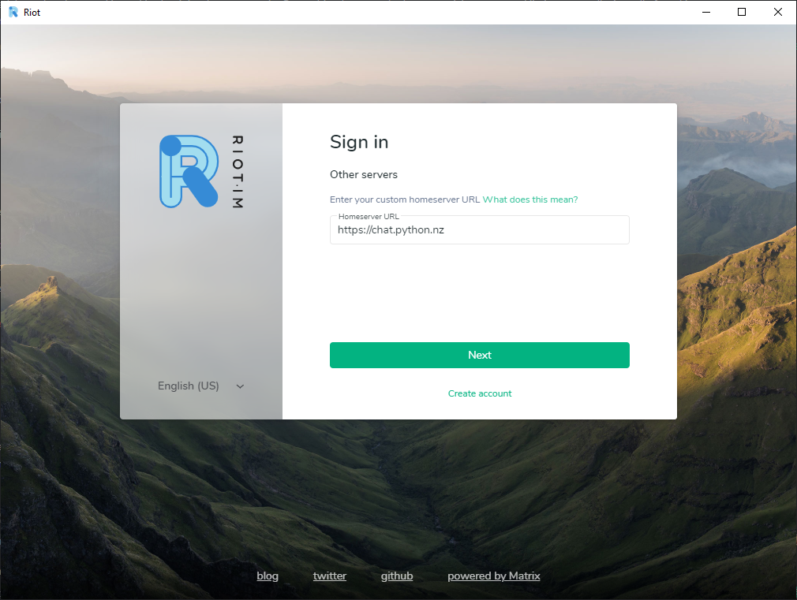

# NZPUG Chat

The New Zealand Python User Group hosts a [Matrix](https://matrix.org/) chat server and [Riot](https://about.riot.im/) web client for the use of its members and the wider Python community in New Zealand.

[Matrix](https://matrix.org/) is a free an open source chat solution and riot [Riot](https://about.riot.im/) is a free and open source client for matrix available on the web, on mobile and on the desktop.

## Get Started

1. Visit https://chat.python.nz in your browser.
2. Create an account or sign in.

    
Create an Account

1. Click on **Create Account**
2. Set a username and password
3. Enter your email address (recommended)

**Note:** Your email address is required to reset your password or recover 
your account if you get locked out. You can add, edit or remove email 
address at any stage via your profile.

    
Sign in

1. Select **Sign In**
2. Log in with your username and password.

## Mobile

For Riot Mobile you need to set the `Homeserver` URL to `https://chat.python.nz` manually when signing in or registering.

    
Create Account

 1. Check the **'☑️ Use custom server options (advanced)'** option
 2. Enter `https://chat.python.nz` as the `Home Server URL`
 3. Sign up with your email address

    
Sign in

 1. Check the **'☑️ Use custom server options (advanced)'** option
 2. Enter `https://chat.python.nz` as the `Home Server URL`
 3. Sign in with your username or email address and password

## Desktop and Riot Web

For Riot Desktop and Riot Web (https://riot.im/app) you need to set the NZPUG `Homeserver URL` to `https://chat.python.nz` manually before signing in or registering.

    
Step by step instructions

1. Click **Change** next to the text "*Sign in to your account on matrix.org*"

2. For the `Homeserver URL` type in `https://chat.python.nz`

3. Click **Next** To continue.

Now you can [sign in](#sign-in) or [create an account](#create-account) on the chat.python.nz homeserver.

## Maintainer Notes

‼️ Do not run these Ansible or Terraform scripts. The configuration in production has diverged from these scripts and running them will revert local changes.

A task to update and test the scripts is being tracked here (https://github.com/nzpug/chat/issues/11)